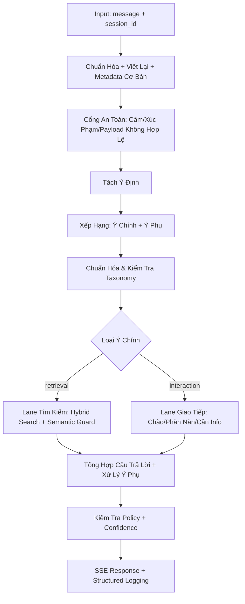
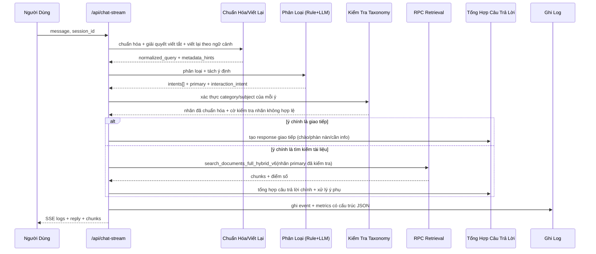
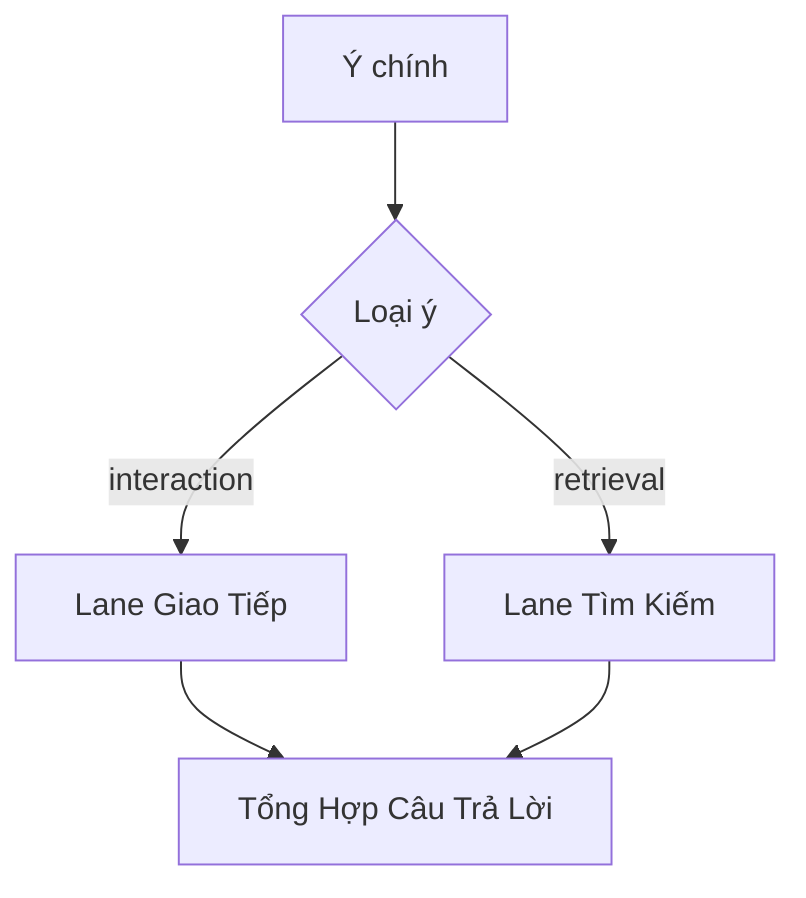

# Luồng Backend V2 (Sau Cải Tiến)

Tài liệu này mô tả luồng kỹ thuật mục tiêu cho endpoint `POST /api/chat-stream` sau khi áp dụng đầy đủ các cải tiến:
- **Taxonomy Contract + Taxonomy Guard**: Đảm bảo tất cả nhãn được gửi đến RPC retrieval đều tồn tại trong cơ sở dữ liệu chunk hiện tại
- **Tách Lane Interaction & Retrieval**: Xử lý riêng biệt các câu hỏi giao tiếp (chào hỏi, phàn nàn) với các câu hỏi tìm kiếm tài liệu
- **Xử lý Multi-intent**: Tách câu có nhiều ý định, xếp hạng theo mức độ ưu tiên, xử lý tuần tự thay vì ép vào một nhãn duy nhất
- **Metadata-Assisted Routing**: Sử dụng dấu hiệu bổ sung (loại thực thể, dạng câu hỏi, tham chiếu thời gian) để hỗ trợ quyết định định tuyến
- **Đánh Giá Theo Nhiều Scoreboard**: Thay vì 1 chỉ số chung, chia thành 4 bảng xếp hạng riêng (retrieval/interaction/robustness/multi-intent)

## 1. Mục Tiêu Thiết Kế

1. **Nhãn Retrieval Phải Khớp 100% Với Taxonomy Hiện Tại** - Không cho phép nhãn ngoài taxonomy đi vào RPC retrieval, tránh trả về kết quả sai
2. **Tách Rõ Bài Toán Giao Tiếp Từ Bài Toán Tìm Kiếm Tài Liệu** - Các câu hỏi tương tác (chào hỏi, phàn nàn) sẽ xử lý riêng, không lẫn với các câu hỏi tìm kiếm
3. **Xử Lý Câu Hỏi Có Nhiều Ý Định Một Cách Hợp Lý** - Thay vì chọn 1 ý duy nhất, hệ thống sẽ tách ý, xếp hạng, và xử lý tuần tự, tránh mất thông tin
4. **Tăng Độ Bền Với Query Ngắn, Viết Tắt, Typo, Nhiễu** - Cải thiện hiệu suất trên các trường hợp đặc biệt thông qua metadata bổ sung và policy linh hoạt
5. **Giảm Hard-code Theo Case Riêng Lẻ** - Ưu tiên cơ chế guardrail theo contract + confidence policy, dễ bảo trì và mở rộng

## 2. Kiến Trúc Runtime Tổng Quan

Biểu đồ luồng dữ liệu quan trọng để hiểu cấu trúc:



**Giải thích chi tiết từng giai đoạn:**
- **Input**: Nhận message từ người dùng cùng với session ID để theo dõi cuộc hội thoại
- **Chuẩn Hóa**: Xử lý viết tắt, lỗi chính tả, chuẩn hóa văn bản để sẵn sàng cho các bước tiếp theo
- **Cổng An Toàn**: Lọc các câu hỏi có nội dung cấm hoặc xúc phạm
- **Tách & Xếp Hạng**: Tách các ý định khác nhau trong câu hỏi, xếp hạng theo độ ưu tiên
- **Kiểm Tra Taxonomy**: Đảm bảo tất cả nhãn đều tồn tại trong cơ sở dữ liệu hiện tại
- **Định Tuyến**: Chọn đường xử lý thích hợp (giao tiếp hoặc tìm kiếm)
- **Tổng Hợp**: Kết hợp các kết quả lại thành câu trả lời liên kết

## 3. Hợp Đồng Dữ Liệu (Mục Tiêu)

Phần này mô tả các cấu trúc dữ liệu quan trọng được sử dụng trong hệ thống để đảm bảo sự nhất quán.

### 3.1 Yêu Cầu Đầu Vào (Input Request)

```json
{
  "message": "Một câu hỏi từ người dùng",
  "session_id": "session-key",
  "use_llm": true,
  "chunk_limit": 3
}
```

**Giải thích:**
- `message`: Câu hỏi gốc từ người dùng (có thể có typo hoặc viết tắt)
- `session_id`: Khóa định danh phiên hội thoại, dùng để ghép các câu hỏi có liên quan
- `use_llm`: Có sử dụng mô hình ngôn ngữ cho fallback không
- `chunk_limit`: Giới hạn số chunk trả về trong câu trả lời

### 3.2 Hợp Đồng Nội Bộ Sau Phân Loại (Classifier Output Contract)

```json
{
  "interaction_intent": "none|chao_hoi|phan_nan|qa_need_info|out_of_scope",
  "intents": [
    {
      "type": "retrieval|interaction",
      "category": "thu_tuc_hanh_chinh",
      "subject": "tu_phap_ho_tich",
      "confidence": 0.82,
      "span": "mất giấy khai sinh"
    }
  ],
  "primary_intent_index": 0,
  "has_conflict": false,
  "signals": {
    "connector_count": 2,
    "multi_intent_probability": 0.75,
    "noise_score": 0.1
  }
}
```

**Giải thích chi tiết:**
- `interaction_intent`: Xác định loại giao tiếp chính nếu có (chào hỏi, phàn nàn, cần thêm info, v.v.)
- `intents[]`: Mảng chứa tất cả các ý định được tách ra, mỗi ý có loại (interaction/retrieval), danh mục, chủ đề, độ tin cậy và đoạn văn bản gốc
- `primary_intent_index`: Chỉ số của ý chính cần ưu tiên xử lý
- `has_conflict`: Có xung đột giữa các ý (ví dụ: hai ý trong cùng danh mục nhưng chủ đề khác nhau)
- `signals`: Các dấu hiệu bổ sung để hỗ trợ quyết định (số connector, xác suất multi-intent, độ multi-intent)

### 3.3 Hợp Đồng Taxonomy (Nguồn Sự Thật)

Tệp đề xuất: `backend/taxonomy_contract.json`

```json
{
  "version": "2026-03-11",
  "categories": {
    "thu_tuc_hanh_chinh": {
      "subjects": ["tu_phap_ho_tich", "so_han_nhan_dan", "dat_dai", ...],
      "chunk_count": 45
    },
    "tai_khoan": {
      "subjects": ["dang_nhat_chu_tuy_tai_khoan", "thay_doi_thong_tin", ...],
      "chunk_count": 32
    }
  },
  "total_chunks": 230,
  "generation_source": "supabase.documents",
  "last_updated": "2026-03-11T10:00:00Z"
}
```

**Nguyên tắc quan trọng:**
- Danh sách `valid_categories` được sinh từ các chunk đang hoạt động trong cơ sở dữ liệu
- Danh sách `valid_subjects` theo mỗi danh mục được sinh từ các chunk đang hoạt động
- Mỗi nhãn từ classifier (rule hoặc LLM) đều phải chuẩn hóa + xác thực trước khi gửi đến RPC retrieval
- Nhãn không hợp lệ **không được phép** đi vào `search_documents_full_hybrid_v6`, phải được loại bỏ hoặc chuyển đổi

## 4. Trình Tự End-to-End (Kỹ Thuật)



**Luồng thực thi chi tiết:**
1. Người dùng gửi câu hỏi đến endpoint `/api/chat-stream` với session ID
2. Hệ thống chuẩn hóa câu hỏi: giải quyết viết tắt, chuẩn hóa văn bản, trích xuất metadata
3. Phân loại câu hỏi thành một hoặc nhiều ý định, xác định ý chính
4. Kiểm tra kỹ lưỡng: tất cả nhãn phải tồn tại trong taxonomy contract
5. Dựa trên loại ý chính (giao tiếp hay tìm kiếm), chọn đường xử lý phù hợp
6. Trả về kết quả qua SSE stream và ghi log chi tiết cho phân tích

## 5. Pipeline Chi Tiết Theo Từng Giai Đoạn

### Giai Đoạn A: Chuẩn Hóa, Viết Lại, Trích Xuất Metadata

**Mục đích**: Chuẩn bị dữ liệu đầu vào để các bước tiếp theo có thể làm việc chính xác

1. **Phân tích yêu cầu**: Lấy các trường `message`, `session_id`, `use_llm`, `chunk_limit` từ request
2. **Giải quyết viết tắt & teencode**: Chạy `AbbreviationResolver` để mở rộng các viết tắt phổ biến (cccd → căn cước công dân, tp → thành phố, etc.)
3. **Chuẩn hóa văn bản**: Chuyển `normalized_query` để phục vụ matching rule và retrieval (xóa gấu, dấu câu không cần thiết)
4. **Viết lại theo ngữ cảnh**: Nếu có lịch sử hội thoại, viết lại câu hỏi hiện tại để bao gồm ngữ cảnh từ câu trước nếu cần
5. **Trích xuất metadata nhẹ**:
   - `token_count`: Số từ để phát hiện query ngắn
   - `connector_count`: Số connector (và, với, rồi, sau đó, v.v.) để phát hiện multi-intent
   - `noisy_text_score`: Điểm số chỉ ra mức độ "bẩn" của văn bản (typo, inconsistency)
   - `has_question_mark`: Có dấu hỏi không, chỉ ra là câu hỏi rõ ràng

**Output Giai Đoạn A:**
- `origin_message`: Câu hỏi mOriginal
- `expanded_message`: Sau khi giải quyết viết tắt
- `normalized_query`: Sau khi chuẩn hóa
- `metadata_hints`: JSON chứa các signal bổ sung

### Giai Đoạn B: Cổng An Toàn / Policy Gate

**Mục đích**: Lọc các câu hỏi có nội dung cấm hoặc vi phạm chính sách

1. **Xác thực payload**: Kiểm tra toàn vẹn của dữ liệu đầu vào
2. **Kiểm tra từ khóa bị cấm**: Quét `BANNED_KEYWORDS` và chính sách an toàn
3. **Nếu vi phạm**: Trả về sớm với `event_type` phù hợp (ví dụ: `banned_topic`), ghi log đầy đủ để kiểm soát

**Output Giai Đoạn B:**
- `gate_passed`: `true|false`
- `event_type`: Loại sự kiện nếu bị chặn (ví dụ: `banned_topic`, `abuse_detected`)

### Giai Đoạn C: Tách Ý Định (Intent Decomposition)

**Mục đích**: Tách các ý định khác nhau trong một câu hỏi để xử lý chính xác

1. **Tách câu theo connector**: Sử dụng các từ nối (và, với, rồi, sau đó, v.v.) và dấu câu để tạo candidate spans
2. **Phân loại từng span**: Sử dụng rule-first approach: quy tắc đầu tiên, nếu không chắc chắn mới qua LLM
3. **Fallback LLM cho span không rõ**: Những span có confidence thấp được gửi đến LLM để phân loại
4. **Gộp các intent tương đồng**: Nếu hai intent thuộc cùng category, subject gần nhau, hoặc span có nghĩa gần giống, gộp để tránh trùng lặp

**Output Giai Đoạn C:**
- `intents[]`: Mảng các intent được tách ra
- `interaction_intent`: Loại giao tiếp chính nếu có
- `has_conflict`: Có xung đột giữa các ý không

### Giai Đoạn D: Xếp Hạng Ý Chính & Ý Phụ

**Mục đích**: Xác định ý nào là quan trọng nhất để xử lý trước

Công thức điểm tổng hợp:

$$\text{priority\_score} = w_{\text{confidence}} \cdot \text{confidence} + w_{\text{specificity}} \cdot \text{specificity} + w_{\text{retrieval\_need}} \cdot \text{retrieval\_need}$$

**Giải thích các thành phần:**
- `confidence`: Độ tin cậy của classifier cho intent (0.0 - 1.0)
- `specificity`: Cao hơn khi subject phù hợp và span có đủ thông tin (ví dụ: "mất giấy khai sinh" > "mất giấy tờ" nói chung)
- `retrieval_need`: Cao hơn nếu cần truy xuất chunk từ cơ sở dữ liệu để trả lời (VD: câu hỏi thủ tục > câu chào hỏi)
- `w_*`: Các trọng số cân bằng (cộng lại = 1.0)

**Quy tắc:**
- Intent có điểm cao nhất là `primary_intent` (ưu tiên xử lý trước)
- Các intent còn lại là `secondary_intents` (xử lý sau, có thể rút gọn hoặc hỏi lấy ý kiến)
- Nếu hai intent top-2 rất gần nhau (delta < threshold): Trả lời primary + hỏi làm rõ secondary

**Output Giai Đoạn D:**
- `primary_intent_index`: Chỉ số của ý chính trong mảng intents
- `secondary_intents`: Danh sách các ý phụ

### Giai Đoạn E: Kiểm Tra Taxonomy (Bắt Buộc)

**Mục đích**: Đảm bảo tất cả nhãn đều hợp lệ trước khi truy xuất

Cho mỗi retrieval intent:
1. **Chuẩn hóa nhãn**: 
   - Trim whitespace, chuyển thành lowercase
   - Ứng dụng alias mapping (nếu có)
   - Loại bỏ ký tự đặc biệt không cần
   
2. **Xác thực với taxonomy contract**:
   - Kiểm tra `category` có trong `valid_categories` không
   - Kiểm tra `subject` có trong `valid_subjects` của category không
   
3. **Nếu không hợp lệ**:
   - Đặt `category=None` hoặc `subject=None`
   - Đặt cờ `invalid_label_guard_triggered=true`
   - Lưu `label_before_guard` và `label_after_guard` cho debugging
   - Đừng gửi label này vào `search_documents_full_hybrid_v6`

**Bảo đảm kỹ thuật:**
- Không có nhãn ngoài taxonomy được phép đi vào RPC retrieval dưới bất kỳ hoàn cảnh nào

### Giai Đoạn F: Định Tuyến Lane (Lane Routing)

**Mục đích**: Chọn đường xử lý thích hợp dựa trên loại ý chính



**Lane Giao Tiếp** - Xử lý các ý tương tác:
- `chao_hoi` (chào hỏi): Trả lời lịch sự + hướng dẫn/chào
- `phan_nan` (phàn nàn/feedback): Tiếp nhận phàn nàn + hướng dẫn kênh xử lý
- `qa_need_info` (cần thêm info): Hỏi bổ sung thông tin để hiểu rõ hơn
- `out_of_scope` (ngoài phạm vi): Trả lời an toàn + kiểm soát phạm vi

**Lane Tìm Kiếm Tài Liệu** - Xử lý các ý tìm kiếm:
1. Gọi retrieval theo nhãn primary đã được guard
2. Nếu score thấp, fallback có kiểm soát:
   - Giữ category, bỏ subject nếu policy cho phép (tìm kiếm rộng hơn)
   - Không được vượt taxonomy guard
3. Nếu thuộc `thu_tuc_hanh_chinh`, áp dụng semantic guard để đảm bảo chất lượng

### Giai Đoạn G: Tổng Hợp Câu Trả Lời (Answer Synthesis)

**Mục đích**: Kết hợp kết quả xử lý từ các ý thành một câu trả lời liên kết

1. **Phần A - Trả lời chính**: Dựa trên ý chính (có chứng cứ từ chunk nếu retrieval)
2. **Phần B - Xử lý ý phụ**:
   - Secondary interaction: Thêm một câu giao tiếp ngắn
   - Secondary retrieval: Retrieval nhẹ hoặc hỏi làm rõ
3. **Đảm bảo chất lượng**: Response ngắn gọn, có hướng dẫn hành động tiếp theo

### Giai Đoạn H: Confidence Policy & Final Gate

**Mục đích**: Kiểm tra lần cuối trước khi trả về kết quả

1. Nếu confidence thấp + chứng cứ yếu: Trả `qa_need_info` thay vì câu trả lời sai
2. Nếu signal ngoài domain rõ ràng: Trả `out_of_scope` để kiểm soát phạm vi
3. Nếu đạt yêu cầu: Stream trả lời bình thường qua SSE

## 6. Metadata-Assisted Routing (Nên Áp Dụng)

**Nguyên tắc quan trọng**: Metadata là tín hiệu hỗ trợ, không phải quyền quyết định cuối cùng. Nó giúp cải thiện xếp hạng ý định nhưng không được phép bỏ qua taxonomy guard.

**Metadata được đề xuất để trích xuất:**
- `entity_type`: Loại thực thể trong câu hỏi (person/org/location/document)
  - Ví dụ: "Ban Điều hành" → org, "Hà Nội" → location
- `query_form`: Dạng câu hỏi (ask_info/procedure/how_to/complaint/greeting)
  - Ví dụ: "Làm sao để...?" → how_to, "Tôi muốn...?" → ask_info
- `time_ref`: Tham chiếu thời gian (past/present/future)
  - Ví dụ: "Hôm qua", "Bây giờ", "Tuần tới"
- `topic_hint`: Gợi ý chủ đề (giúp phân biệt các danh mục gần nhau)
  - Ví dụ: "Căn cước công dân" → hint danh mục giấy tờ
- `multi_intent_hint`: Một câu hỏi có nhiều ý hay không (true/false)
  - Ví dụ: "tôi và vợ tôi" → có thể multi-intent, "tôi một mình" → single

**Nguyên tắc sử dụng metadata:**
1. Metadata được sử dụng để **tăng độ chính xác** của ranking/disambiguation (tăng score cho ý phù hợp)
2. Metadata **không được phép** bỏ qua taxonomy guard dưới bất kỳ hoàn cảnh nào
3. Metadata có confidence thấp **không được phép** ép định tuyến

**Ví dụ áp dụng:**
- Query: "Nếu tôi sở hữu nhà ở tp Hồ Chí Minh, tôi có cần thuế không?"
- `topic_hint` = "bất động sản", giúp disambiguate giữa `dat_dai` và `xay_dung_nha_o`
- `entity_type` = org (tp Hồ Chí Minh), giúp xác định scope địa phương
- Kết quả: Vẫn phải kiểm tra taxonomy, nhưng metadata giúp chọn subject chính xác hơn

## 7. Logging Schema V2 (Chi Tiết & Có Cấu Trúc)

**Các trường cần bổ sung** (lưu trong `log_query` hoặc serialize thành JSON payload):

```json
{
  "query_id": "uuid",
  "timestamp": "2026-03-11T10:30:00Z",
  "session_id": "session-key",
  "origin_message": "Người dùng nhập gì",
  "normalized_query": "Sau khi chuẩn hóa",
  "is_multi_intent": true,
  "intent_count": 2,
  "primary_intent": {
    "type": "retrieval|interaction",
    "category": "thu_tuc_hanh_chinh",
    "subject": "tu_phap_ho_tich",
    "confidence": 0.85
  },
  "secondary_intents": [...],
  "interaction_intent": "none|chao_hoi|phan_nan|qa_need_info|out_of_scope",
  "invalid_label_guard_triggered": false,
  "label_before_guard": null,
  "label_after_guard": null,
  "routing_lane": "interaction|retrieval",
  "fallback_path": "original|category_only|qa_need_info",
  "taxonomy_version": "2026-03-11",
  "response_latency_ms": 245,
  "chunk_count_returned": 2,
  "confidence_policy_result": "pass|low_confidence|out_of_scope",
  "metadata_signals": {
    "connector_count": 2,
    "multi_intent_probability": 0.78,
    "noise_score": 0.12
  }
}
```

**Mục tiêu logging:**
- **Debug nhanh mismatch**: Xem lại toàn bộ quyết định của từng bước
- **Đo được tác dụng của guardrails**: Bao nhiêu % trường hợp bị catch bởi taxonomy guard
- **Làm dầu vào cho active-learning loop**: Lấy các trường hợp mismatch để cải thiện classifier

**Chỉ số quan trọng từ log:**
- `invalid_label_guard_count / total_queries` → Tỷ lệ nhãn bị flags (nên giảm dần khi classifier cải thiện)
- `fallback_path` distribution → Hiểu các fallback path phổ biến nhất
- `confidence_policy_result=low_confidence` count → Nắm được tần suất hỏi bổ sung thông tin

## 8. Đánh Giá Chất Lượng (Multi-Scoreboard)

**Thay vì 1 chỉ số chung, chia thành 4 bảng xếp hạng riêng biệt:**

### 8.1 Retrieval Scoreboard (Tìm Kiếm Tài Liệu)
- **Chỉ số**: Category accuracy, Subject accuracy (tính trên taxonomy-valid set)
- **Loại bỏ**: Các case có `expected_label_invalid=true` trong dataset (vì là lỗi dữ liệu, không phải model fail)
- **Mục tiêu**: Chỉ số này tăng từ baseline 76.1% lên 82.5% trở lên

### 8.2 Interaction Scoreboard (Giao Tiếp)
- **Chỉ số**: Độ chính xác cho từng loại giao tiếp: `chao_hoi`, `phan_nan`, `qa_need_info`, `out_of_scope`
- **Test set riêng**: 20-30 case được Annotate cho từng loại
- **Mục tiêu**: ≥ 90% accuracy cho mỗi loại

### 8.3 Robustness Scoreboard (Bền Vững)
- **Chỉ số**: Pass rate theo bucket khó khăn:
  - `short` (≤ 3 tokens): Mục tiêu +40% so với baseline (từ 30.8% → 50%+)
  - `abbr` (có viết tắt): Mục tiêu ≥ 85%
  - `multi` (multi-intent): Mục tiêu ≥ 80%
  - `ambiguous` (mập mờ): Mục tiêu ≥ 75%
- **Mục tiêu**: Mỗi bucket đều ≥ 75%+

### 8.4 Multi-Intent Scoreboard
- **Chỉ số**:
  - `primary_intent_accuracy`: Chọn đúng ý chính (≥ 85%)
  - `secondary_handled_rate`: Ý phụ được xử lý chứ không bị bỏ quên (≥ 80%)
  - `multi_intent_fallback_rate`: % trường hợp fallback thành Q&A need info (nên ≤ 15%)
- **Mục tiêu**: Tất cả ≥ 80%+

## 9. Failure Handling & Fallback Policy (Chính Sách Xử Lý Lỗi)

**Khi nào fallback?**

1. **Classifier Không Chắc Chắn (confidence cao)**:
   - **Hành động**: Không đoán bừa; hỏi bổ sung thông tin
   - **Response**: "Bạn có thể nêu rõ hơn được không?" + hướng dẫn cụ thể

2. **Taxonomy Mismatch (Label Không Hợp Lệ)**:
   - **Hành động**: Chuẩn hóa nhãn; không gửi nhãn invalid vào RPC
   - **Response**: Fallback tuỳ tinh ứ: generic answer hoặc hỏi làm rõ

3. **Retrieval Rỗng hoặc Score Thấp** (không tìm thấy chunk phù hợp):
   - **Hành động**: Fallback có kiểm soát:
     - Thử rộng category, bỏ subject nếu được phép
     - Nếu vẫn rỗng: hỏi làm rõ hoặc suggest liên hệ trực tiếp
   - **Không làm**: Không gửi nhãn invalid vào RPC

4. **LLM Output Không Đúng Format** (LLM trả về nhãn ngoài taxonomy):
   - **Hành động**: Parser nghiêm ngặt + bảo vệ mặc định
   - **Response**: Fallback an toàn (hỏi bổ sung) thay vì trả sai

5. **Secondary Retrieval Không Đủ Tín Hiệu** (ý phụ không tìm được chunk tốt):
   - **Hành động**: Trì hoãn + hỏi tiếp thay vì trả lời sai
   - **Response**: Trước tiên trả lời ý chính + "Bạn có muốn tôi giúp gì thêm không?"

## 10. Mapping Vào Codebase Hiện Tại

**Các tệp chính cần cải tiến:**

- **`backend/app.py`**
  - Orchestration các giai đoạn pipeline
  - Tách lane interaction & retrieval
  - Gọi taxonomy guard validator
  - Tổng hợp response từ nhiều ý intention
  - Structured logging JSON

- **`backend/test_demo.py`**
  - Rule-first classification logic
  - Decompose intents từ single query
  - Rank intents theo priority_score formula
  - Confidence policy thực thi

- **`backend/model.py`**
  - LLM fallback classification
  - Strict output format cho multi-intent
  - Parser bảo vệ cho LLM output

- **`backend/normalize.py`**
  - Mở rộng chuẩn hóa cho typo/viết tắt/noise
  - Trích xuất metadata hints

- **`retest_classification.py`**
  - Xuất 4 scoreboard riêng biệt
  - Check `expected_label_invalid` flag
  - Tính pass rate theo bucket (short/abbr/multi/ambiguous)

## 11. Chiến Lược Rollout (Triển Khai Từng Bước)

**Feature Flags Đề Xuất:**
- `ENABLE_TAXONOMY_GUARD` (default: False → True)
- `ENABLE_MULTI_INTENT` (default: False → True)
- `ENABLE_METADATA_ASSIST` (default: False → True)

**Rollout Theo Traffic:**
- **Week 1**: Taxonomy Guard ở 10% traffic
- **Week 2**: Taxonomy Guard ở 30% traffic
- **Week 3**: Taxonomy Guard ở 60% traffic
- **Week 4**: Taxonomy Guard ở 100% + Multi-Intent ở 10%
- **Week 5-6**: Multi-Intent ở 30-60%, Metadata-Assist ở 10-30%

**Trigger Rollback Tự Động:**
- Tăng 5xx đột biến (> 2x baseline)
- Retrieval accuracy giảm mạnh (> 5% so với baseline)
- Fallback rate bất thường (> 50% queries)

## 12. Definition of Done (Tiêu Chí Hoàn Thành)

1. ✅ Nhãn invalid gửi vào retrieval RPC = 0 (100% được catch)
2. ✅ `primary_intent_accuracy` đạt ngưỡng mục tiêu đã đặt ra (≥ 85%)
3. ✅ Retrieval accuracy trên taxonomy-valid set tăng so với baseline (76.1% → 82.5%+)
4. ✅ Không regression về 5xx rate và SLA độ trễ
5. ✅ Dashboard + mismatch review hàng tuần được vận hành ổn định

## 13. Ví Dụ Kỹ Thuật (Trước/Sau Cải Tiến)

### Ví Dụ 1: Query Ngoài Phạm Vi Retrieval

**Input**: `"Tôi bị mất CCCD, có đi máy bay được không?"`

**Trước Cải Tiến:**
- Có nguy cơ bị ép nhầm vào `thu_tuc_hanh_chinh` và trả lời sai hướng (vì mentioning "mất" + "giấy tờ")
- Classifier không phân biệt được là câu hỏi lệch ngoài scope

**Sau Cải Tiến:**
- Intent được nhận diện là `qa_need_info` hoặc `out_of_scope` (theo policy)
- Không bắt buộc retrieval label (category=None, subject=None)
- Response: "Đây không phải phạm vi của chatbot. Bạn vui lòng liên hệ Cục An Ninh Xã Hội hoặc hãng hàng không."

### Ví Dụ 2: Query Multi-Intent

**Input**: `"Tôi vừa sinh con và mua nhà thì có xử lý được không?"`

**Trước Cải Tiến:**
- Hệ thống có thể chọn ý "sinh con" hoặc ý "mua nhà", bỏ sót ý còn lại
- Trả lời không đầy đủ, người dùng không hài lòng

**Sau Cải Tiến:**
- **Tách 2 intent**:
  - Intent A: `thu_tuc_hanh_chinh/tu_phap_ho_tich` (khai sinh/đăng ký khai sinh)
  - Intent B: `thu_tuc_hanh_chinh/dat_dai` hoặc `xay_dung_nha_o` (tuỳ context)
- **Xếp hạng**: Primary = khai sinh (xác suất cao hơn), Secondary = mua nhà
- **Response 2 phần**:
  - Phần chính: Hướng dẫn khai sinh
  - Phần phụ: "Về phần mua nhà, bạn cần..." hoặc "Bạn muốn biết thêm về thủ tục mua nhà không?"
  
**Kết quả:** Người dùng nhận được thông tin đầy đủ cho cả hai ý, không bỏ sót.
