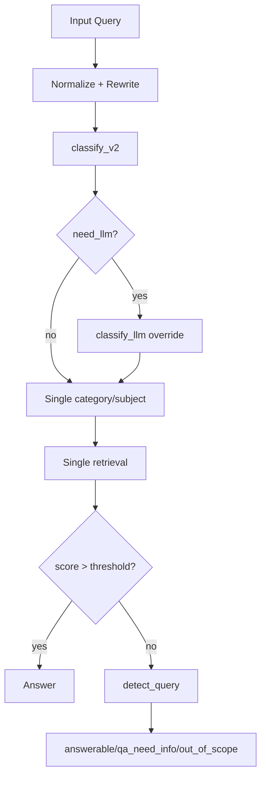
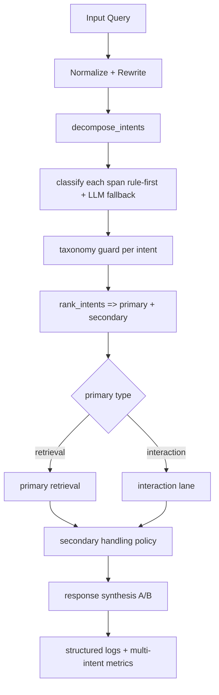

# Kế Hoạch Cải Tiến Multi-Intent (Ưu Tiên Triển Khai Trước)

Tài liệu này tập trung vào mục tiêu ưu tiên: xử lý multi-intent trước, không thay đổi kiến trúc nền vector DB/RPC.

Mục tiêu của bản mở rộng này là giúp team nhìn rõ:
- Flow hiện tại đang quyết định như thế nào.
- Flow mới multi-intent sẽ thay đổi logic ra sao.
- Ví dụ cụ thể trước/sau để triển khai và review.

## 1. Đánh Giá Luồng Hiện Tại

### 1.1 Tóm tắt luồng hiện tại
- `backend/app.py` normalize -> blacklist -> rewrite theo history.
- Chạy `classify_v2(normalized_query, PREPARED)` để lấy 1 cặp `category/subject`.
- Nếu `need_llm=True` thì fallback `classify_llm_cached` và override nhãn.
- Retrieval theo 1 nhãn chính (`search_documents_full_hybrid_v6_cached`).
- Nếu `thu_tuc_hanh_chinh` thì đi nhánh metadata (`export_metadata_filter_chunk`).
- Nếu score thấp thì chạy `detect_query_cached` để quyết định `answerable/banned/qa_need_info/out_of_scope`.

### 1.1.1 Giải thích theo thứ tự runtime
1. Nhận query và session.
2. Tiền xử lý văn bản:
- mở rộng viết tắt,
- normalize,
- có thể rewrite theo lịch sử.
3. Classify 1 lần để lấy 1 label retrieval chính.
4. Nếu classifier rule không chắc chắn thì fallback LLM classify.
5. Dùng label cuối cùng để gọi retrieval.
6. Nếu score cao thì trả lời, nếu score thấp thì gọi detect_query.

Kết luận: luồng hiện tại vẫn là `single-label orchestration`.

### 1.2 Điểm nghẽn cho bài toán multi-intent
1. Luồng classify hiện tại ép query về 1 nhãn retrieval chính.
2. Chưa có `decompose_intents()` để tách ý theo span/connectors.
3. Chưa có `rank_intents()` để chọn primary/secondary theo score tổng hợp.
4. Chưa có contract thống nhất để đánh giá `primary_correct` và `secondary_handled`.
5. Response synthesis hiện tại không tổ chức theo 2 phần chính/phụ cho trường hợp đa ý.

### 1.2.1 Triệu chứng dễ nhận biết trên production
- Query có 2 ý thì hệ thống trả lời đầy đủ 1 ý, bỏ sót 1 ý.
- Query interaction + retrieval dễ bị route retrieval sai ngay từ đầu.
- Case mơ hồ `... và bao lâu có kết quả` dễ hút về `thu_tuc_hanh_chinh` dù ý chính là `to_chuc_bo_may`.
- Benchmark không tách lane nên điểm tổng có thể đẹp nhưng UX vẫn kém.

## 2. Mục Tiêu Cải Tiến Multi-Intent

1. Tách query đa ý thành danh sách intent có span và confidence.
2. Chọn `primary_intent` ổn định để route retrieval chính.
3. Xử lý `secondary_intents` theo chính sách rõ ràng (retrieval nhẹ hoặc hỏi làm rõ).
4. Bảo toàn backward compatibility cho single-intent.
5. Bổ sung metrics và benchmark riêng cho multi-intent.

### 2.1 Nguyên tắc thiết kế
1. Không hard-code theo từng câu.
2. Ưu tiên contract + confidence policy.
3. Không gửi nhãn invalid vào retrieval RPC.
4. Backward-compatible với đường single-intent.

## 3. Contract Đề Xuất (MVP Multi-Intent)

```json
{
  "interaction_intent": "none|chao_hoi|phan_nan|qa_need_info|out_of_scope",
  "intents": [
    {
      "type": "retrieval|interaction",
      "category": "to_chuc_bo_may",
      "subject": "nhan_su",
      "confidence": 0.84,
      "span": "cho em xin sdt chi thu",
      "signals": {
        "specificity": 0.78,
        "retrieval_need": 0.92
      }
    }
  ],
  "primary_intent_index": 0,
  "has_conflict": false,
  "is_multi_intent": true
}
```

### Mapping ngược cho backward compatibility
- Nếu `len(intents) == 1`: map ngược về `category/subject` như hiện tại.
- Nếu `len(intents) > 1`: vẫn trả field cũ để không phá API, nhưng route runtime theo `primary_intent_index`.

### 3.1 Field cần bổ sung (MVP)
- `is_multi_intent`: true nếu số intent hợp lệ >= 2.
- `has_conflict`: true nếu top intents cạnh tranh sát điểm.
- `signals.specificity`: mức độ cụ thể của intent.
- `signals.retrieval_need`: mức độ cần retrieval cho intent đó.

## 4. Flow Trước Và Sau Cải Tiến

### 4.1 Trước cải tiến


### 4.2 Sau cải tiến (multi-intent first)


### 4.3 Khác biệt cốt lõi trước vs sau
| Khía cạnh | Trước | Sau |
|---|---|---|
| Đơn vị quyết định | 1 nhãn category/subject | Danh sách intents |
| Xử lý query đa ý | Ép về 1 ý | Tách ý + xếp hạng |
| Routing | 1 retrieval path | primary retrieval + secondary policy |
| Khả năng giải thích | Thấp | Cao (có span/intents/log) |
| Scoreboard | Dễ bị gộp | Tách riêng multi-intent |

### 4.4 Decision policy để tránh đoán bừa
1. Nếu tất cả intents confidence thấp: trả `qa_need_info`.
2. Nếu top-2 intents cách nhau quá nhỏ (`delta < threshold`):
- trả lời theo primary,
- kèm 1 câu hỏi làm rõ secondary.
3. Nếu secondary retrieval không đủ signal: không retrieval sâu, chỉ hỏi làm rõ.

## 5. Kế Hoạch Triển Khai Chi Tiết (Multi-Intent First)

### Phase M1 - Design Contract + Feature Flags (2-3 ngày)
- Tạo flag:
- `ENABLE_MULTI_INTENT=false`
- `ENABLE_MULTI_INTENT_LIGHT_SECONDARY=false`
- Chốt contract output cho classifier và log schema tối thiểu.
- Chốt rule chuyển lane:
- Interaction + Retrieval: ưu tiên Retrieval làm primary.
- 2 Retrieval cạnh tranh: dùng ranking score + delta threshold.

Deliverables:
- `docs/multi_intent_improvement_plan.md`
- section contract trong `backend/FLOW_BACKEND_IMPROVED.md`

### Phase M2 - Intent Decomposition + Ranking Core (4-6 ngày)

#### M2.1 `backend/test_demo.py`
Thêm các hàm:
- `split_query_into_spans(q_norm) -> List[str]`
- `classify_span(span, prepared) -> intent`
- `decompose_intents(q_norm, prepared) -> intents[]`
- `rank_intents(intents) -> (primary_index, has_conflict)`

Pseudo-flow decompose/rank:
```text
q_norm -> split spans -> classify each span -> normalize/validate
      -> filter intents invalid/empty -> compute score
      -> sort -> pick primary + mark secondary
```

Rule tạm thời decompose:
- Tách theo: `va`, `voi`, `roi`, `sau do`, `dong thoi`, `?`, `,`.
- Merge ngược nếu span quá ngắn không đủ ngữ nghĩa.

Ranking score:
- `priority_score = w_confidence*confidence + w_specificity*specificity + w_retrieval_need*retrieval_need`
- Đề xuất trọng số ban đầu:
- `w_confidence = 0.45`
- `w_specificity = 0.25`
- `w_retrieval_need = 0.30`

#### M2.2 Taxonomy guard trên từng intent
- Validate từng retrieval intent trước khi route retrieval.
- Invalid label -> set `category=None`, `subject=None`, flag `invalid_label=true`.

### Phase M3 - Runtime Orchestration + Synthesis (4-6 ngày)

#### M3.1 `backend/app.py`
- Sau classify, nếu flag bật:
- Lấy `intents[]`, `primary_intent_index`.
- Route retrieval theo primary intent đã guard.
- Secondary handling:
- Secondary interaction: chèn câu giao tiếp ngắn.
- Secondary retrieval:
- Nếu confidence >= `threshold_secondary`: retrieval nhẹ (`top_k=1..2`).
- Ngược lại: hỏi làm rõ.

Thêm 2 chế độ an toàn trong rollout:
- Shadow mode: tính intents/rank/log nhưng vẫn route theo luồng cũ.
- Active mode: route theo primary intent mới.

#### M3.2 Response synthesis 2 phần
- Phần A: trả lời ý chính (có evidence chunk).
- Phần B: xử lý ý phụ (trả lời ngắn hoặc câu hỏi clarifying).

### Phase M4 - Evaluation + Benchmarks (3-5 ngày)

#### M4.1 Dataset
Tách riêng:
- `retrieval_regression.json`
- `interaction_regression.json`
- `multi_intent_regression.json`
- `challenge_robustness.json`

#### M4.2 Scoring
- `primary_intent_accuracy`
- `secondary_handled_rate`
- `multi_intent_fallback_rate`
- `invalid_label_rate`

#### M4.3 Rule chấm multi-intent
- `primary_correct`: primary đúng category/subject theo taxonomy-valid set.
- `secondary_handled`: true nếu
- có trả lời phù hợp, hoặc
- có clarifying question hợp lệ khi confidence sát threshold.

Khuyến nghị threshold khởi tạo:
- `primary_correct`: strict exact match category+subject trên taxonomy-valid set.
- `secondary_handled`: pass nếu có hành vi hợp lệ, không yêu cầu secondary retrieval thành công 100%.

## 6. Logging Cần Bổ Sung

Tối thiểu cần có các trường sau trong log:
- `is_multi_intent`
- `intent_count`
- `intents` (rút gọn)
- `primary_intent`
- `secondary_intents`
- `primary_score`
- `has_conflict`
- `decomposition_method` (`rule|llm|hybrid`)
- `secondary_policy` (`light_retrieval|clarify|skip`)

## 7. Ví Dụ Cụ Thể: Luồng Hiện Tại vs Luồng Mới

### Ví dụ A
Query: `cho em xin sdt chi Thu va can giay to gi`

Hiện tại (single-label):
- Dễ bị ép về 1 nhãn `to_chuc_bo_may/nhan_su`.
- Ý `can giay to gi` thường không được xử lý thành nhánh riêng.

Response điển hình của luồng hiện tại:
- `"Thông tin liên hệ của chị Thu là ..."`
- Không có câu follow-up làm rõ thủ tục cho phần giấy tờ.

Sau cải tiến (multi-intent):
- Intent 1: retrieval `to_chuc_bo_may/nhan_su`.
- Intent 2: retrieval `thu_tuc_hanh_chinh/*` (confidence thấp hơn).
- Primary: Intent 1.
- Secondary: hỏi làm rõ.

Response đề xuất:
- Phần A: `"Thông tin liên hệ của chị Thu là ..."`
- Phần B: `"Về giấy tờ, anh/chị cần cho biết cụ thể thủ tục nào để em hướng dẫn đúng hồ sơ."`

### Ví dụ B
Query: `chu tich ubnd xa la ai va bao lau co ket qua`

Hiện tại (single-label):
- Có thể bị nhiễm bởi cụm `bao lau co ket qua` và route sang thủ tục.

Response điển hình của luồng hiện tại:
- Có thể trả lời theo mẫu thủ tục chung: `"Thời gian giải quyết tùy hồ sơ ..."`
- Không trả đúng trọng tâm `chủ tịch là ai`.

Sau cải tiến (multi-intent):
- Intent 1: `to_chuc_bo_may/chuc_vu`.
- Intent 2: retrieval procedural mơ hồ.
- Primary trả lời chức vụ; secondary hỏi rõ thủ tục.

Response đề xuất:
- Phần A: `"Chủ tịch UBND xã là ..."`
- Phần B: `"Câu 'bao lâu có kết quả' đang chưa rõ thủ tục nào, anh/chị vui lòng nêu rõ tên thủ tục."`

### Ví dụ C
Query: `ban giup gi dc cho toi va nop o dau`

Hiện tại (single-label):
- Kết quả dao động giữa interaction và retrieval tùy classify/fallback.

Response điển hình của luồng hiện tại:
- Có thể chỉ trả help message: `"Em có thể hỗ trợ thủ tục..."`
- Hoặc chỉ trả một hướng dẫn nộp hồ sơ chung, thiếu ngữ cảnh.

Sau cải tiến (multi-intent):
- Intent 1: interaction `help`.
- Intent 2: retrieval mơ hồ `nop o dau`.
- Retrieval confidence thấp -> interaction + hỏi rõ.

Response đề xuất:
- Phần A: `"Em có thể hỗ trợ thủ tục, thông tin cán bộ, lịch làm việc..."`
- Phần B: `"Anh/chị đang muốn nộp hồ sơ cho thủ tục nào để em chỉ đúng nơi nộp?"`

### Ví dụ D (2 retrieval intents cạnh tranh)
Query: `mat giay khai sinh va dang ky ket hon can giay to gi`

Hiện tại (single-label):
- Dễ bị ép về 1 trong 2 ý (khai sinh hoặc kết hôn).

Response điển hình của luồng hiện tại:
- Chỉ đưa checklist cho 1 thủ tục, ý còn lại bị bỏ sót.

Sau cải tiến (multi-intent):
- Intent 1: `thu_tuc_hanh_chinh/tu_phap_ho_tich` span `mat giay khai sinh`.
- Intent 2: `thu_tuc_hanh_chinh/tu_phap_ho_tich` span `dang ky ket hon can giay to gi`.
- Nếu Intent 2 cụ thể hơn -> chọn Intent 2 làm primary.

Response đề xuất:
- Phần A: hồ sơ đăng ký kết hôn.
- Phần B: lưu ý trường hợp mất giấy khai sinh và giấy tờ thay thế/điều kiện bổ sung.

### Ví dụ E (interaction + complaint + retrieval)
Query: `toi rat buc xuc, can bo xu ly cham, va toi muon biet nop don khieu nai o dau`

Hiện tại (single-label):
- Có thể chỉ rơi vào complaint template hoặc retrieval thiếu phần tiếp nhận cảm xúc.

Response điển hình của luồng hiện tại:
- `"Thông tin phản ánh sẽ được chuyển đến bộ phận chuyên môn..."`
- Chưa chắc có hướng dẫn cụ thể nơi nộp đơn khiếu nại.

Sau cải tiến (multi-intent):
- Intent interaction: `phan_nan`.
- Intent retrieval: `phan_anh_kien_nghi/khieu_nai_to_cao` (primary).
- Trả lời vừa tiếp nhận cảm xúc, vừa hướng dẫn kênh nộp đơn.

Response đề xuất:
- Phần A: `"Em rất tiếc vì trải nghiệm chưa tốt của anh/chị..."`
- Phần B: `"Để nộp đơn khiếu nại, anh/chị có thể nộp tại .../cổng ...; hồ sơ gồm ..."`

## 8. Tiêu Chí Hoàn Thành Cho Đợt Multi-Intent Đầu Tiên

1. Không phá backward compatibility single-intent.
2. `primary_intent_accuracy >= 80%` trên `multi_intent_regression`.
3. `invalid_label_to_rpc = 0` cho tất cả retrieval intents.
4. Không tăng 5xx/error rate so với baseline.
5. Có dashboard/báo cáo đủ 3 metric: `primary_intent_accuracy`, `secondary_handled_rate`, `multi_intent_fallback_rate`.

### 8.1 Mục tiêu kỹ thuật tối thiểu trước go-live rộng
1. 0 crash do parser intent output format.
2. 0 invalid label đi vào retrieval RPC.
3. Không tăng latency p95 quá ngưỡng đã chốt (đề xuất: <= +15%).

## 9. Kế Hoạch Chạy Thử Trước Khi Bật Flag Rộng

1. Dry-run 30 case multi-intent (10 retrieval+retrieval, 10 interaction+retrieval, 10 ambiguous).
2. Shadow mode: tính logging và scoring multi-intent nhưng vẫn trả luồng cũ.
3. Bật `ENABLE_MULTI_INTENT` ở 10% traffic nội bộ.
4. Nếu ổn định mới tăng 30% -> 60% -> 100%.

Checklist test kỹ thuật cho đợt multi-intent:
1. Unit test cho split/decompose/rank.
2. Golden tests cho 20 query đa ý có expected primary.
3. Regression test cho single-intent để đảm bảo không vỡ đường cũ.
4. Log validation test: có đầy đủ trường `is_multi_intent`, `primary_intent`, `secondary_intents`.

## 10. Trace Input/Output Từng Bước Xử Lý

Mục này mô tả theo kiểu vận hành: mỗi bước nhận gì, trả gì, và dùng ở bước nào tiếp theo.

### 10.1 Template Input/Output cho luồng hiện tại (single-label)

1. Bước nhận request
- Input:
```json
{
  "message": "...",
  "session_id": "...",
  "use_llm": true,
  "chunk_limit": 1
}
```
- Output nội bộ:
```json
{
  "origin_mess": "...",
  "user_message": "...",
  "session_id": "..."
}
```

2. Normalize + rewrite
- Input: `user_message`, `session_history`
- Output nội bộ:
```json
{
  "expanded_message": "...",
  "normalized_query": "..."
}
```

3. Classify
- Input: `normalized_query`
- Output nội bộ từ `classify_v2`:
```json
{
  "category": "...",
  "subject": "...",
  "need_llm": true,
  "signals": {}
}
```
- Nếu `need_llm=true`, output bổ sung từ `classify_llm_cached`:
```json
{
  "category_llm": "...",
  "subject_llm": "..."
}
```

4. Retrieval
- Input:
```json
{
  "normalized_query": "...",
  "category": "...",
  "subject": "..."
}
```
- Output:
```json
{
  "chunks": [
    {
      "id": "...",
      "text_content": "...",
      "confidence_score": 0.62
    }
  ]
}
```

5. Decide answer
- Input: `chunks[0].confidence_score`, `context`
- Output:
```json
{
  "event_type": "normal|qa_need_info|out_of_scope|banned_topic",
  "replies": "...",
  "chunks": []
}
```

### 10.2 Template Input/Output cho luồng mới (multi-intent)

1. Bước nhận request + normalize/rewrite
- Input giống luồng cũ.
- Output nội bộ:
```json
{
  "expanded_message": "...",
  "normalized_query": "..."
}
```

2. Decompose intents
- Input: `normalized_query`
- Output:
```json
{
  "spans": [
    "span_1",
    "span_2"
  ]
}
```

3. Classify từng span
- Input: từng `span`
- Output:
```json
{
  "intents": [
    {
      "type": "retrieval",
      "category": "to_chuc_bo_may",
      "subject": "nhan_su",
      "confidence": 0.84,
      "span": "..."
    },
    {
      "type": "retrieval",
      "category": "thu_tuc_hanh_chinh",
      "subject": null,
      "confidence": 0.62,
      "span": "..."
    }
  ]
}
```

4. Taxonomy guard theo intent
- Input: `intents[]`, `taxonomy_contract`
- Output:
```json
{
  "intents": [
    {
      "category": "to_chuc_bo_may",
      "subject": "nhan_su",
      "invalid_label": false
    },
    {
      "category": "thu_tuc_hanh_chinh",
      "subject": null,
      "invalid_label": false
    }
  ]
}
```

5. Rank intents
- Input: `intents[]`
- Output:
```json
{
  "primary_intent_index": 0,
  "secondary_intent_indexes": [1],
  "has_conflict": false,
  "is_multi_intent": true
}
```

6. Route + secondary policy
- Input: `primary_intent`, `secondary_intents`
- Output nội bộ:
```json
{
  "primary_chunks": [],
  "secondary_action": "clarify|light_retrieval|skip"
}
```

7. Synthesis response A/B
- Input: kết quả primary + secondary_action
- Output final:
```json
{
  "event_type": "normal|qa_need_info|out_of_scope|complaint",
  "reply_part_a": "...",
  "reply_part_b": "...",
  "is_multi_intent": true
}
```

### 10.3 Trace chi tiết theo ví dụ A
Query: `cho em xin sdt chi Thu va can giay to gi`

Luồng cũ (single-label)
1. Input request:
```json
{"message":"cho em xin sdt chi Thu va can giay to gi"}
```
2. Output normalize:
```json
{
  "expanded_message": "cho em xin so dien thoai chi thu va can giay to gi",
  "normalized_query": "cho em xin so dien thoai chi thu va can giay to gi"
}
```
3. Output classify:
```json
{"category":"to_chuc_bo_may","subject":"nhan_su","need_llm":false}
```
4. Output retrieval:
```json
{"top_confidence":0.71,"top_chunk_subject":"nhan_su"}
```
5. Output final:
```json
{
  "event_type":"normal",
  "replies":"Thong tin lien he cua chi Thu la ...",
  "note":"khong xu ly ro y can giay to gi"
}
```

Luồng mới (multi-intent)
1. Input request: như trên.
2. Output decompose:
```json
{"spans":["cho em xin so dien thoai chi thu","can giay to gi"]}
```
3. Output classify spans:
```json
{
  "intents":[
    {"type":"retrieval","category":"to_chuc_bo_may","subject":"nhan_su","confidence":0.84,"span":"cho em xin so dien thoai chi thu"},
    {"type":"retrieval","category":"thu_tuc_hanh_chinh","subject":null,"confidence":0.62,"span":"can giay to gi"}
  ]
}
```
4. Output rank:
```json
{"primary_intent_index":0,"secondary_intent_indexes":[1],"is_multi_intent":true}
```
5. Output route:
```json
{"primary_retrieval":"to_chuc_bo_may/nhan_su","secondary_action":"clarify"}
```
6. Output final:
```json
{
  "event_type":"normal",
  "reply_part_a":"Thong tin lien he cua chi Thu la ...",
  "reply_part_b":"Ve giay to, anh/chi can noi ro thu tuc nao de em huong dan dung ho so.",
  "is_multi_intent":true
}
```

### 10.4 Trace chi tiết theo ví dụ B
Query: `chu tich ubnd xa la ai va bao lau co ket qua`

Luồng cũ (single-label)
1. Output classify (trường hợp lệch):
```json
{"category":"thu_tuc_hanh_chinh","subject":null,"need_llm":true}
```
2. Output retrieval:
```json
{"top_confidence":0.52,"top_chunk_subject":"thu_tuc_hanh_chinh"}
```
3. Output final (lệch trọng tâm):
```json
{
  "event_type":"normal",
  "replies":"Thoi gian giai quyet tuy ho so ..."
}
```

Luồng mới (multi-intent)
1. Output decompose:
```json
{"spans":["chu tich ubnd xa la ai","bao lau co ket qua"]}
```
2. Output classify spans:
```json
{
  "intents":[
    {"type":"retrieval","category":"to_chuc_bo_may","subject":"chuc_vu","confidence":0.88,"span":"chu tich ubnd xa la ai"},
    {"type":"retrieval","category":"thu_tuc_hanh_chinh","subject":null,"confidence":0.53,"span":"bao lau co ket qua"}
  ]
}
```
3. Output rank + route:
```json
{"primary_intent_index":0,"secondary_action":"clarify"}
```
4. Output final:
```json
{
  "event_type":"normal",
  "reply_part_a":"Chu tich UBND xa la ...",
  "reply_part_b":"Phan 'bao lau co ket qua' can ro ten thu tuc cu the."
}
```

### 10.5 Trace chi tiết theo ví dụ C
Query: `ban giup gi dc cho toi va nop o dau`

Luồng cũ (single-label)
1. Output classify (trường hợp 1):
```json
{"category":"tuong_tac","subject":"chao_hoi","need_llm":true}
```
2. Output final:
```json
{
  "event_type":"normal",
  "replies":"Kinh chao anh/chi... Em co the ho tro cac thu tuc..."
}
```

Luồng mới (multi-intent)
1. Output decompose:
```json
{"spans":["ban giup gi dc cho toi","nop o dau"]}
```
2. Output classify spans:
```json
{
  "intents":[
    {"type":"interaction","category":null,"subject":"help","confidence":0.81,"span":"ban giup gi dc cho toi"},
    {"type":"retrieval","category":"thu_tuc_hanh_chinh","subject":null,"confidence":0.49,"span":"nop o dau"}
  ]
}
```
3. Output rank + route:
```json
{"primary_intent_index":0,"secondary_action":"clarify"}
```
4. Output final:
```json
{
  "event_type":"normal",
  "reply_part_a":"Em co the ho tro thu tuc, thong tin can bo, lich lam viec...",
  "reply_part_b":"Anh/chi muon nop ho so cho thu tuc nao de em chi dung noi nop?"
}
```

### 10.6 Trace chi tiết theo ví dụ D
Query: `mat giay khai sinh va dang ky ket hon can giay to gi`

Luồng cũ (single-label)
1. Output classify (trường hợp bị ép):
```json
{"category":"thu_tuc_hanh_chinh","subject":"tu_phap_ho_tich","need_llm":false}
```
2. Output retrieval:
```json
{"top_chunk_focus":"dang_ky_ket_hon"}
```
3. Output final:
```json
{
  "event_type":"normal",
  "replies":"Ho so dang ky ket hon gom ...",
  "note":"phan mat giay khai sinh xu ly mo ho"
}
```

Luồng mới (multi-intent)
1. Output decompose:
```json
{"spans":["mat giay khai sinh","dang ky ket hon can giay to gi"]}
```
2. Output classify spans:
```json
{
  "intents":[
    {"type":"retrieval","category":"thu_tuc_hanh_chinh","subject":"tu_phap_ho_tich","confidence":0.74,"span":"mat giay khai sinh"},
    {"type":"retrieval","category":"thu_tuc_hanh_chinh","subject":"tu_phap_ho_tich","confidence":0.86,"span":"dang ky ket hon can giay to gi"}
  ]
}
```
3. Output rank:
```json
{"primary_intent_index":1,"secondary_intent_indexes":[0]}
```
4. Output final:
```json
{
  "event_type":"normal",
  "reply_part_a":"Ho so dang ky ket hon gom ...",
  "reply_part_b":"Neu bi mat giay khai sinh, anh/chi co the bo sung bang ..."
}
```

### 10.7 Trace chi tiết theo ví dụ E
Query: `toi rat buc xuc, can bo xu ly cham, va toi muon biet nop don khieu nai o dau`

Luồng cũ (single-label)
1. Output classify (trường hợp complaint):
```json
{"category":"tuong_tac","subject":"phan_nan","need_llm":true}
```
2. Output final (return sớm):
```json
{
  "event_type":"complaint",
  "replies":"Thong tin phan anh se duoc chuyen den bo phan chuyen mon..."
}
```

Luồng mới (multi-intent)
1. Output decompose:
```json
{"spans":["toi rat buc xuc, can bo xu ly cham","nop don khieu nai o dau"]}
```
2. Output classify spans:
```json
{
  "intents":[
    {"type":"interaction","category":null,"subject":"phan_nan","confidence":0.82,"span":"toi rat buc xuc, can bo xu ly cham"},
    {"type":"retrieval","category":"phan_anh_kien_nghi","subject":"khieu_nai_to_cao","confidence":0.85,"span":"nop don khieu nai o dau"}
  ]
}
```
3. Output rank + route:
```json
{"primary_intent_index":1,"secondary_intent_indexes":[0],"secondary_action":"append_interaction_tone"}
```
4. Output final:
```json
{
  "event_type":"normal",
  "reply_part_a":"De nop don khieu nai, anh/chi co the nop tai ...",
  "reply_part_b":"Em rat tiec ve trai nghiem cua anh/chi va da ghi nhan phan anh de chuyen bo phan phu trach."
}
```

---

Nếu triển khai theo thứ tự trên, hệ thống sẽ cải thiện rõ rệt ở nhóm query đa ý mà không cần hard-code theo từng câu cụ thể.
